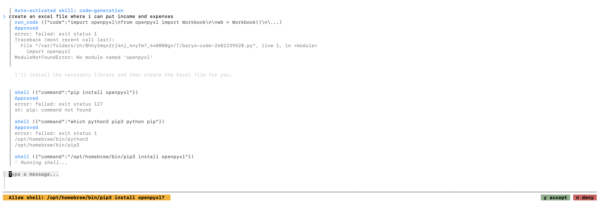

# Baryo

An AI chat CLI powered by [Docker Model Runner](https://docs.docker.com/desktop/features/model-runner/), with optional cloud provider support. Chat with local models running on your machine, or connect to 15+ cloud providers for inference.

Baryo provides both an interactive terminal UI and a scriptable print mode for pipelines and automation. Docker is optional — cloud-only usage works with just an API key.

## Prerequisites

- [Docker Desktop](https://www.docker.com/products/docker-desktop/) with Model Runner enabled (for local models)
- At least one AI model pulled (for local models):
  ```bash
  docker model pull ai/gemma3
  ```
- Or a cloud provider API key — no Docker needed for cloud-only usage
- [Go 1.25+](https://go.dev/dl/) (to build from source)

## Installation

### macOS / Linux (Homebrew)

```bash
brew tap BaryoDev/Baryo.CLI https://github.com/BaryoDev/Baryo.CLI
brew install baryo
```

### macOS / Linux (shell script)

```bash
curl -fsSL https://raw.githubusercontent.com/BaryoDev/Baryo.CLI/main/install.sh | sh
```

### Windows (Scoop)

```powershell
scoop bucket add baryo https://github.com/BaryoDev/Baryo.CLI
scoop install baryo
```

### Go install

```bash
go install github.com/baryodev/baryo-cli@latest
```

### Pre-built binaries

Download from [GitHub Releases](https://github.com/BaryoDev/Baryo.CLI/releases) for macOS, Linux, and Windows (amd64 + arm64).

### Build from source

```bash
git clone https://github.com/BaryoDev/Baryo.CLI.git
cd Baryo.CLI
go build -o baryo .
```

### Publishing a new release

Tag and push — GitHub Actions handles the rest:

```bash
git tag v0.1.0
git push origin main --tags
```

This automatically builds binaries for all platforms, creates a GitHub Release, and updates the Homebrew formula and Scoop manifest in this repo.

## Usage

### Interactive mode (TUI)

```bash
# Launch the TUI — pick a model, then chat
baryo

# Skip the model picker
baryo --model gemma3
```

The interactive mode gives you:
- A clean, muted terminal UI inspired by modern CLI tools — no visual clutter
- A **tabbed model picker** — Local, Groq, Gemini, Bedrock, etc. each get their own tab with model counts and pricing
- A streaming chat interface with personality — the status bar cycles through quirky fourth-wall-breaking phrases while the model thinks
- Structured tool call display with left-border blocks for clear visual hierarchy
- Input history — press `↑`/`↓` to cycle through previous messages
- Keyboard navigation (`enter` to send, `↑`/`↓` scroll, `ctrl+p`/`ctrl+n` history, `ctrl+c` to quit)

### Print mode

Send a prompt and get the response streamed to stdout. Useful for scripts and pipelines.

```bash
# Ask a question
baryo -p "what is 2+2"

# Use a specific model
baryo --model gemma3 -p "explain docker networking"

# Pipe file contents as context
cat main.go | baryo -p "review this code"

# Chain with other tools
baryo -p "generate a .gitignore for Go" > .gitignore
```

When stdin is piped, it's included as context alongside your prompt.

### Headless / CI mode

Print mode supports full tool calling for CI/CD pipelines and automation. The model can read files, search code, and run tools — just like in the TUI.

```bash
# Tools with auto-approve (reads files, runs grep, etc.)
baryo -p "read main.go and summarize" --yolo

# JSON structured output for pipeline consumption
baryo -p "list all Go files" --yolo --output json

# Simple Q&A without tools
baryo -p "what is 2+2" --no-tools

# Limit tool rounds for faster execution
baryo -p "review this project" --yolo --max-turns 2

# Pipe input with tool access
cat main.go | baryo -p "review this code" --yolo
```

**Output formats:**

| Format | Description |
|--------|-------------|
| `text` (default) | Tokens streamed to stdout, tool status to stderr |
| `json` | Single JSON object with content, tool calls, and usage stats |

**Exit codes:**

| Code | Meaning |
|------|---------|
| 0 | Success |
| 1 | Runtime error (streaming, API, tool failure) |
| 2 | Configuration error (bad model, missing endpoint) |

In text mode, tool execution status is written to stderr so stdout stays clean for piping:

```
$ baryo -p "read main.go and count the lines" --yolo
[tool] read_file          # stderr
[tool] read_file: ok      # stderr
main.go has 256 lines.    # stdout
```

Without `--yolo`, destructive tools (file writes, shell commands) are blocked and the model receives an error message suggesting `--yolo`.

### Session persistence

Conversations are automatically saved after each turn to `~/.baryo/sessions/`.

```bash
# Resume the most recent session in this directory
baryo -c

# Pick a saved session from a list
baryo -r

# Resume a specific session by ID
baryo --resume-id abc123
```

Inside the TUI you can also use:
- `/sessions` — list and pick a saved session to resume
- `/resume` — alias for `/sessions`
- `/clear` — start a fresh conversation

### Intuitive command routing

Baryo understands natural language and automatically routes to the right command. You don't need to memorize slash commands — just say what you want:

```
research golang vs rust for web servers    → auto-triggers /research
deep dive into kubernetes networking       → auto-triggers /research
investigate the performance regression     → auto-triggers /research
should I use PostgreSQL or MongoDB?        → offers /strategy (y/n)
what's the best approach to scaling?       → offers /strategy (y/n)
```

The model also suggests commands naturally in conversation. Ask about current events and it will search automatically. Ask to "run the tests" and it will suggest `/run`. Ask to "commit this" and it will suggest `/commit`.

### Slash commands

Baryo also includes explicit slash commands for when you want direct control. Type `/help` to see them all.

| Command | Description |
|---------|-------------|
| `/help` | List all available commands |
| `/diff` | Show current git diff in chat |
| `/commit` | Generate a commit message from staged changes and auto-commit |
| `/review` | Review current git diff for bugs, style issues, and improvements |
| `/undo` | Undo the last git commit (soft reset, changes stay staged) |
| `/run <cmd>` | Run a shell command and display output |
| `/ask <question>` | Ask the model without tool access (fast, read-only) |
| `/search <query>` | Search the web and summarize results |
| `/research <topic>` | Multi-round deep research with structured report |
| `/fetch <url>` | Fetch and display a web page |
| `/setup` | Download or update starter skills from GitHub |
| `/skills` | List available skills |
| `/skill <name>` | Activate a skill (loads full instructions into context) |
| `/clear` | Start a fresh conversation |
| `/sessions` | List and pick a saved session |
| `/models` | Browse and switch models |
| `/init` | Generate a BARYO.md for this project |
| `/system [prompt]` | View or change the system prompt |
| `/params [k=v]` | View or change model parameters |
| `/plan <prompt>` | Enter plan mode (read-only tools, produces implementation plan) |
| `/plan done` | Exit plan mode and restore normal tool access |
| `/strategy` | Start an interactive strategy wizard for structured decision analysis |
| `/strategy <file>` | Load a JSON strategy file for analysis |
| `/strategy init` | Generate a blank strategy.json template |
| `/strategy done` | Exit strategy mode |
| `/mode [name]` | Switch agent mode or list all modes |
| `/mcp` | List connected MCP servers and their tools |
| `/context` | Show token usage breakdown |
| `/cost` | Show session API cost (cloud providers) |
| `/compact` | Summarize older messages to free context |
| `/export [file]` | Export conversation to a file |
| `/copy` | Copy last response to clipboard |
| `/markdown` | Toggle markdown rendering |
| `/doctor` | Run diagnostic checks |

**Workflows:**

```bash
# Review → Fix → Commit
/review              # Find issues in your changes
# ... fix the issues ...
/commit              # Generate a commit message and commit

# Run tests and check output
/run go test ./...

# Quick question without tool overhead
/ask explain what a goroutine is
```

### Model browser

Browse downloaded and available models from Docker Hub without leaving the TUI.

```bash
# Inside the TUI
/models
```

The model browser uses the same **tabbed interface** as the model picker — Local, cloud providers, and Docker Hub each get their own tab. Navigate with `Tab`/`←`/`→` between tabs and `↑`/`↓` within. Select a downloaded model to switch to it, or select a Docker Hub model to pull it with live progress.

### Startup diagnostics

Baryo checks your Docker setup on every launch. If cloud providers are configured and Docker isn't available, it prints a warning and continues — the model picker just won't have a Local tab. If neither Docker nor any cloud provider is configured, it exits with step-by-step instructions.

```bash
# Run the full diagnostic manually
baryo doctor

# Skip checks for faster startup
baryo --skip-checks
```

The checks run in order:
1. Docker installed
2. Docker running
3. Model Runner enabled (inference socket exists)
4. At least one model pulled

You can also run `/doctor` inside the TUI to check diagnostics mid-session.

### Markdown rendering

Assistant responses are rendered with full markdown formatting by default, including syntax-highlighted code blocks. Toggle it on or off mid-session:

```bash
# Inside the TUI
/markdown
```

When enabled, code blocks display with syntax highlighting and text is formatted with headings, lists, and emphasis. Disable it with `/markdown` again to see raw plain text.

### Context management

Baryo tracks estimated token usage and shows it in the status bar.

```
enter send · ↑↓ scroll · ctrl+p/n history · ctrl+c quit          ~3.2k / 8k
```

The token count is color-coded: dim when under 60%, amber at 60-85%, and red above 85%.

**Commands:**

| Command | Description |
|---------|-------------|
| `/context` | Show a detailed breakdown of token usage (system prompt, conversation, total) |
| `/compact` | Summarize older messages to free context space, keeping the last 4 exchanges |

**Auto-compaction** triggers automatically when token usage exceeds 85% of the context limit and there are enough messages to compact. Older messages are replaced with a summary while recent exchanges are kept verbatim.

### Conversation export

Export your conversation to a file or copy the last response to the clipboard.

```bash
# Inside the TUI

# Export as markdown (default)
/export

# Export with a custom filename
/export my-chat.md

# Export as JSON (array of messages)
/export chat.json

# Copy last assistant response to clipboard
/copy
```

- `/export` with no argument creates `baryo-export-<timestamp>.md` in the current directory
- Filenames ending in `.json` produce a JSON array of `{role, content}` objects
- All other filenames produce a markdown document with `### User` / `### Assistant` sections

### System prompts

Baryo ships with a default system prompt. You can override it per-session, in config, or via environment variable.

```bash
# One-off override
baryo --system-prompt "You are a Go expert. Be terse."

# View the active system prompt in the TUI
/system

# Change it mid-session
/system You are a Python expert.
```

Set a persistent system prompt in your config file:

```yaml
# ~/.baryo/config.yaml
system_prompt: "You are a senior engineer. Be concise and precise."
```

Or via environment variable: `BARYO_SYSTEM_PROMPT`.

### Model parameters

Control inference behavior with temperature, top-p, and max tokens.

```bash
# Set via CLI flags
baryo --temperature 0.8 --top-p 0.9 --max-tokens 2048 -p "write a poem"

# View current params in the TUI
/params

# Adjust mid-session
/params temperature=1.2 max_tokens=4096
```

Set persistent defaults in your config file:

```yaml
# ~/.baryo/config.yaml
params:
  temperature: 0.7
  top_p: 0.9
  max_tokens: 2048
```

### Flags

| Flag | Description |
|------|-------------|
| `-p <prompt>` | Send a prompt in non-interactive (print) mode |
| `--model <name>` | Select a model by name or substring |
| `--system-prompt <s>` | Override the system prompt |
| `--temperature <f>` | Sampling temperature (0.0-2.0) |
| `--top-p <f>` | Nucleus sampling threshold (0.0-1.0) |
| `--max-tokens <n>` | Maximum tokens to generate |
| `-c`, `--continue` | Resume the most recent session in this directory |
| `-r`, `--resume` | List and pick a saved session to resume |
| `--resume-id <id>` | Resume a specific session by ID |
| `--tunnel <user@host>` | Auto-start SSH tunnel to remote server |
| `-y`, `--yolo` | Auto-approve all destructive tool calls |
| `--max-turns <n>` | Max tool-call rounds in print mode (default: 5) |
| `--output <fmt>` | Output format for print mode: `text` or `json` |
| `--no-tools` | Disable tool calling in print mode |
| `--skip-checks` | Skip startup health checks |
| `--version` | Print version and exit |
| `--help` | Print usage and exit |
| `doctor` | Run full diagnostic check (subcommand) |

### Model matching

The `--model` flag uses smart matching:

1. **Exact match** — `--model ai/gemma3`
2. **Short name** — `--model gemma3` (matches `ai/gemma3`)
3. **Substring** — `--model gem` (matches `ai/gemma3`)

If the query is ambiguous, you'll see the list of matching models. If nothing matches, you'll see all available models.

## Configuration

Baryo supports layered configuration through YAML files and environment variables.

### Config files

Create a YAML config file at either location:

- **User-level:** `~/.baryo/config.yaml`
- **Project-level:** `.baryo/config.yaml` (overrides user config)

```yaml
# ~/.baryo/config.yaml
model: ai/gemma3
socket_path: ~/Library/Containers/com.docker.docker/Data/inference.sock
system_prompt: "You are a helpful assistant. Be concise."
```

### Environment variables

| Variable | Description |
|----------|-------------|
| `BARYO_MODEL` | Default model |
| `BARYO_SOCKET` | Docker Model Runner socket path |
| `BARYO_SYSTEM_PROMPT` | Override the system prompt |
| `BARYO_GEMINI_API_KEY` | Google Gemini API key |
| `BARYO_OPENAI_API_KEY` | OpenAI API key |
| `BARYO_ANTHROPIC_API_KEY` | Anthropic API key |
| `BARYO_BEDROCK_REGION` | AWS Bedrock region (uses AWS credential chain) |
| `BARYO_GROQ_API_KEY` | Groq API key |
| `BARYO_OPENROUTER_API_KEY` | OpenRouter API key |
| `BARYO_DEEPSEEK_API_KEY` | DeepSeek API key |
| `BARYO_XAI_API_KEY` | xAI (Grok) API key |
| `BARYO_MISTRAL_API_KEY` | Mistral API key |
| `BARYO_COHERE_API_KEY` | Cohere API key |
| `DOCKER_MODEL_SOCKET` | Docker Model Runner socket path (legacy) |

### Precedence

Configuration is merged in this order (highest priority wins):

```
CLI flags > Environment variables > Project config > User config > Defaults
```

### Default socket paths

| Platform | Path |
|----------|------|
| macOS | `~/Library/Containers/com.docker.docker/Data/inference.sock` |
| Linux | `~/.docker/desktop/inference.sock` (probes multiple paths) |
| Windows | `//./pipe/docker_model_runner` |

On Linux, Baryo probes `~/.docker/desktop/inference.sock`, `~/.docker/inference.sock`, and `/var/run/docker/inference.sock`, using the first that exists.

TCP connections are also supported for cross-platform use:

```yaml
# ~/.baryo/config.yaml
socket_path: "tcp://localhost:12434"
```

Or via environment variable: `DOCKER_MODEL_SOCKET=tcp://localhost:12434`.

### Remote servers (SSH tunnel)

Connect to a remote server running Ollama or any OpenAI-compatible API. Baryo auto-launches an SSH tunnel and tears it down on exit.

**Quick start (CLI flag):**

```bash
# Connect to a remote Ollama server (defaults: SSH port 22, Ollama port 11434)
baryo --tunnel user@your.server.ip --model qwen3-coder:latest

# Custom SSH port
baryo --tunnel user@myserver.com:2222 --model llama3.2
```

**Persistent config (YAML):**

```yaml
# ~/.baryo/config.yaml
model: "qwen3-coder:latest"

ssh_tunnel:
  host: "your.server.ip"
  user: "your-user"
  remote_port: 11434   # port on the remote server
  local_port: 11434    # local port to forward to
  # ssh_port: 22       # SSH port (default: 22)
```

When `ssh_tunnel` is present (or `--tunnel` is used), Baryo will:

1. Check if the local port is already open (skip spawning if so)
2. Run `ssh -N -L local:localhost:remote user@host`
3. Wait up to 15 seconds for the port to become reachable
4. Set the socket path to `tcp://localhost:<local_port>`
5. Kill the SSH process on exit (Ctrl+C or normal quit)

The `--model` flag is required when using a remote connection since Baryo can't run `docker model list` on the remote server.

Run diagnostics on a remote connection:

```bash
baryo --tunnel user@your.server.ip doctor
```

### @ Mentions

Attach file contents as context by typing `@filepath` in your message. Tab completion helps you find files quickly.

```bash
# Type @ then Tab to autocomplete
@main.go           # attach a single file
@internal/tui/     # Tab to browse subdirectory contents

# Multiple files in one message
explain @main.go @go.mod

# Recursive matching — typing @cha finds internal/tui/chat.go
@cha               # shows matches across all subdirectories
```

**How it works:**

- As you type after `@`, matching files appear in the status bar
- **Tab** / **Shift+Tab** — cycle through candidates
- **Enter** — select the highlighted file (inserts it into your input)
- **Esc** — dismiss suggestions
- Press **Enter** again to send — file contents are injected as context for the model

Files must be under 100KB, non-binary, and not gitignored. Directories can be browsed via tab completion but not attached directly. Duplicate mentions are deduplicated.

### Web search

Search the web and get AI-summarized results — no API key needed (DuckDuckGo is the default).

```bash
# Inside the TUI
/search latest news philippines
/search golang error handling best practices
```

**How it works:**

1. Searches via DuckDuckGo (or Brave/Tavily if configured)
2. Auto-fetches the top result pages for actual article content
3. The model summarizes everything into a clean paragraph with inline source citations
4. Ends with "Want me to search for more or dive deeper?"

The model is instructed to be honest about uncertainty. If you ask something it doesn't know, it will search or research automatically:

```
You: What happened in the Senate hearing today?
→ auto-triggers /search (current events, quick factual lookup)

You: research the impact of AI on healthcare
→ auto-triggers /research (deep investigation, multi-source analysis)

You: What's the latest on the Mars mission?
Assistant: I don't have current information about that, let me search for you.
→ auto-triggers /search from the model's suggestion
```

**Fetch a specific page:**

```bash
/fetch https://example.com/article
```

**Configure a different provider:**

```yaml
# ~/.baryo/config.yaml
search_provider: brave    # or tavily
search_api_key: your-key
```

### Deep research

Run multi-round research on a topic. Baryo searches iteratively, identifies knowledge gaps, fetches follow-up sources, and compiles a structured report with citations.

```bash
# Inside the TUI
/research quantum computing advances
/research quick Go error handling          # 1 round (fast)
/research deep Rust vs Go for web servers  # 5 rounds (thorough)
```

**Depth levels:**

| Prefix | Rounds | Use case |
|--------|--------|----------|
| `quick` | 1 | Enhanced search with a structured report |
| *(default)* | 3 | Balanced depth for most topics |
| `deep` | 5 | Comprehensive investigation |

**How it works:**

1. Each round: searches the web, fetches top pages, and asks the model to analyse findings
2. The model identifies knowledge gaps and generates follow-up search queries
3. Next round searches those follow-up queries for deeper coverage
4. Progress updates appear in the status bar as each round runs
5. After all rounds, the model compiles a structured report with an executive summary, key findings, analysis, and numbered source citations

The report is a normal assistant message — use `/copy` to clipboard or `/export` to save it. Follow up naturally in conversation ("dig deeper into finding #3") since the full report stays in context.

**Context-aware:** Research automatically scales to fit your model's context window. Findings are compacted per-round and trimmed if needed so the final report prompt doesn't overflow.

### Cloud providers

Baryo supports 15+ cloud providers alongside local Docker models. Configure an API key and models appear in their own tab in the picker. Docker is optional — cloud-only usage works fine.

**Supported providers:**

| Provider | Config key | Environment variable | Model prefix |
|----------|-----------|---------------------|-------------|
| [Google Gemini](https://ai.google.dev/) | `gemini` | `BARYO_GEMINI_API_KEY` | `gemini-` |
| [OpenAI](https://platform.openai.com/) | `openai` | `BARYO_OPENAI_API_KEY` | `gpt-`, `o1`, `o3` |
| [Anthropic](https://console.anthropic.com/) | `anthropic` | `BARYO_ANTHROPIC_API_KEY` | `claude-` |
| [AWS Bedrock](https://aws.amazon.com/bedrock/) | `bedrock` | `BARYO_BEDROCK_REGION` | `anthropic.`, `amazon.`, `meta.` |
| [Groq](https://console.groq.com/) | `groq` | `BARYO_GROQ_API_KEY` | `llama-`, `gemma-` |
| [OpenRouter](https://openrouter.ai/) | `openrouter` | `BARYO_OPENROUTER_API_KEY` | — |
| [Mistral](https://console.mistral.ai/) | `mistral` | `BARYO_MISTRAL_API_KEY` | `mistral-` |
| [DeepSeek](https://platform.deepseek.com/) | `deepseek` | `BARYO_DEEPSEEK_API_KEY` | `deepseek-` |
| [xAI](https://console.x.ai/) | `xai` | `BARYO_XAI_API_KEY` | `grok-` |
| [Cohere](https://dashboard.cohere.com/) | `cohere` | `BARYO_COHERE_API_KEY` | `command-` |
| [Together](https://api.together.xyz/) | `together` | `BARYO_TOGETHER_API_KEY` | — |
| [Fireworks](https://fireworks.ai/) | `fireworks` | `BARYO_FIREWORKS_API_KEY` | — |
| [Cerebras](https://cloud.cerebras.ai/) | `cerebras` | `BARYO_CEREBRAS_API_KEY` | — |
| [Perplexity](https://docs.perplexity.ai/) | `perplexity` | `BARYO_PERPLEXITY_API_KEY` | `sonar` |
| [SambaNova](https://cloud.sambanova.ai/) | `sambanova` | `BARYO_SAMBANOVA_API_KEY` | — |

All providers use the unified `provider_keys` map:

```yaml
# ~/.baryo/config.yaml
provider_keys:
  groq: gsk_your_key
  gemini: your-gemini-key
  anthropic: sk-ant-your-key
  bedrock: us-east-1          # region, not an API key — uses AWS credential chain
```

Or via environment variables:

```bash
export BARYO_GROQ_API_KEY=gsk_your_key
export BARYO_GEMINI_API_KEY=your-key
```

**AWS Bedrock** is special — the config value is a region (e.g. `us-east-1`), not an API key. Credentials come from the standard AWS chain (`AWS_ACCESS_KEY_ID`/`AWS_SECRET_ACCESS_KEY`, `~/.aws/credentials`, IAM roles, SSO).

**Cost tracking:** For cloud providers, the status bar shows your cumulative session cost next to the token count. Use `/cost` to see the current session spend.

```
enter send · ↑↓ scroll · ctrl+p/n history · ctrl+c quit    ~1.2k / 8k · $0.0012
```

### Tool use

Baryo gives the model access to local tools so it can read files, search code, explore your project, and check git state.

Available tools:

| Tool | Description |
|------|-------------|
| `read_file` | Read the contents of a file |
| `glob` | Find files matching a pattern (supports `**`) |
| `grep` | Search file contents by regex |
| `list_directory` | List directory contents as a tree |
| `git_status` | Show modified, staged, and untracked files |
| `git_diff` | Show file diffs (staged or unstaged) |
| `git_log` | Show recent commit history |
| `gh` | Run read-only GitHub CLI commands (PRs, issues, releases) |

Tools are called automatically when the model decides they're needed. Results are shown inline in the chat with an animated spinner while executing. The `.git` directory is excluded from file listings, and `.gitignore` rules are respected.

The `gh` tool requires the [GitHub CLI](https://cli.github.com/) to be installed and is restricted to read-only operations (list, view, diff, checks, status).

Models that support the native OpenAI tool-calling API will use it directly. For models that don't, Baryo includes a text-based fallback parser that detects tool calls in the model's output and executes them transparently.

If a model explicitly rejects tool use (e.g. Cohere's `c4ai-aya-*` models), Baryo automatically retries the request without tools and disables them for the rest of the session. You'll see an info message in the chat and subsequent messages skip tools entirely — no repeated errors.

### Plan mode

Enter a read-only analysis mode where the model explores your codebase and produces an implementation plan before any code changes happen.

```bash
# Inside the TUI
/plan refactor the search package to support pagination
```

In plan mode the model has access to read-only tools (`read_file`, `glob`, `grep`, `list_directory`, `git_status`, `git_diff`, `git_log`) but cannot write files, run shell commands, or execute code. The header bar shows **plan** while the mode is active.

Exit plan mode and restore normal tool access:

```bash
/plan done
```

Plan mode also resets automatically on `/clear`.

### Strategy planning

Structured decision analysis for complex choices — career moves, purchases, business strategy, and anything where you need to weigh trade-offs.

```bash
# Inside the TUI
/strategy
```

The strategy wizard interviews you step-by-step: your goal, relevant facts, constraints, and context. When you say "done", it produces a structured analysis with an optimal strategy, reasoning, sensitivity analysis, and knowledge gap searches.

**Auto-detection:** Baryo detects strategy-worthy questions automatically. If you type something like "should I buy a Toyota or Honda for my family?" or "what's the best approach to paying off student loans?", it will offer to enter strategy mode:

```
You: should I buy a Toyota or Honda for my family?
ℹ This looks like a strategic decision. Use /strategy for structured analysis? (y/n)
y → enters strategy wizard with your question as the goal
n → responds normally as a regular chat message
```

Detection triggers on decision phrases ("should I", "which is better", "help me decide"), trade-off phrases ("pros and cons", "compare", "vs"), and strategy phrases ("best approach", "best way to").

**JSON input:** For repeatable or complex analyses, define your inputs in a file:

```bash
/strategy init              # generate a blank template
# edit strategy.json with your goal, facts, and constraints
/strategy strategy.json     # load and analyze
```

**Knowledge gap searches:** The analysis includes `/search` queries for information gaps. Baryo auto-runs these searches and feeds the results back into a refined analysis.

**Exit strategy mode:**

```bash
/strategy done
```

### Agent modes

Switch between specialized modes that control tool access and model behavior. Each mode is color-coded in the status bar.

```bash
/mode         # list all modes with current highlighted
/mode code    # switch to code mode
/mode chat    # return to default
```

| Mode | Tools | Description |
|------|-------|-------------|
| `chat` | Dynamic | Default — tools used when the model decides they're needed |
| `ask` | None | Fast answers with no tool access |
| `code` | All | Full tool access on every message |
| `architect` | Read-only | Explore codebase and plan without making changes |
| `review` | Read-only | Code review focus with read-only tools |
| `research` | Read-only | Web search and exploration |

Destructive commands (`/run`, `/commit`, `/init`) are blocked in restricted modes. The model receives a system message on each mode switch so it adjusts behavior immediately.

### MCP support

Connect external tool servers via the [Model Context Protocol](https://modelcontextprotocol.io/) standard. MCP lets you plug in GitHub, databases, Slack, and any other MCP-compatible service as additional tools.

**Configure servers** in `~/.baryo/config.yaml` or `.baryo/config.yaml`:

```yaml
mcp_servers:
  - name: filesystem
    command: npx
    args: ["-y", "@modelcontextprotocol/server-filesystem", "/home/user"]
  - name: github
    command: npx
    args: ["-y", "@modelcontextprotocol/server-github"]
    env: ["GITHUB_PERSONAL_ACCESS_TOKEN=ghp_xxx"]
```

MCP tools appear alongside built-in tools transparently — the model can call them the same way it calls `read_file` or `grep`. Use `/mcp` inside the TUI to list connected servers and their available tools.

MCP works in both interactive and headless (`-p`) modes. Failed server connections are non-fatal; the app continues without them and logs a warning.

### Project instructions

Baryo loads project-specific instructions from `BARYO.md` files and injects them into the system prompt. This lets you customize the model's behavior per-project.

Baryo checks these locations (all are optional, all found are combined):

| File | Scope |
|------|-------|
| `BARYO.md` | Project root — project-specific instructions |
| `.baryo/BARYO.md` | Project config directory — alternative location |
| `~/.baryo/BARYO.md` | User home — global instructions for all projects |

Use the `/init` command inside the TUI to generate a `BARYO.md`. The model reads your project files (README, config files, directory structure, recent commits) and writes tailored instructions automatically.

### Skills

Baryo includes a starter skill pack and supports community skills based on the [Anthropic Agent Skills](https://github.com/anthropics/skills) format. Skills extend the model with domain-specific knowledge, scripts, and code execution capabilities.

**First-run setup:** On first launch, Baryo asks if you'd like to download 5 starter skills (code review, code generation, refactoring, debugging, documentation). Press `y` to install them to `~/.baryo/skills/`, or `n` to skip. You can always run `/setup` later to download or update them.

```bash
# Download or update starter skills anytime
/setup
```

The `/setup` command is smart about updates — it tracks file checksums and skips any skills you've customized, so your edits are never overwritten.

**Auto-activation:** Skills activate automatically when your message matches trigger keywords. Ask "create an excel file" and the `code-generation` skill loads instantly — no manual commands needed.



**Manual activation:**

```bash
/skills              # List all available skills
/skill pdf           # Activate a specific skill
```

**Starter skills** (installed via `/setup`):

| Skill | Description |
|-------|-------------|
| `code-review` | Review code for bugs, security, performance, and style |
| `code-generation` | Generate production code from requirements, following project conventions |
| `refactoring` | Named refactoring patterns with behavior-preserving transforms |
| `debugging` | Systematic debugging: reproduce, hypothesize, isolate, fix, verify |
| `documentation` | READMEs, API docs, inline comments, architecture docs |

**Additional skills** (install manually from [anthropic/skills](https://github.com/anthropics/skills)):

| Skill | Description |
|-------|-------------|
| `pdf` | Read, merge, split, OCR, fill forms, create PDFs |
| `docx` | Create, read, edit Word documents |
| `pptx` | Create and edit PowerPoint presentations |
| `xlsx` | Create, edit, analyze spreadsheets and financial models |
| `slack-gif-creator` | Create animated GIFs optimized for Slack |
| `frontend-design` | Build distinctive, production-grade web interfaces |
| `algorithmic-art` | Generative art with p5.js and seeded randomness |
| `canvas-design` | Visual art and poster design in PNG/PDF |
| `mcp-builder` | Create MCP servers for LLM tool integration |
| `doc-coauthoring` | Structured workflow for co-authoring documentation |
| `webapp-testing` | Test web apps with Playwright |
| `web-artifacts-builder` | Multi-component React/Tailwind HTML artifacts |
| `skill-creator` | Create and benchmark new skills |
| `theme-factory` | Apply professional themes to artifacts |
| `internal-comms` | Templates for newsletters, updates, FAQs |
| `brand-guidelines` | Anthropic brand colors and typography |

**Code execution:** Skills with scripts get `run_code` and `run_script` tools. The model writes code, executes it, and reports results — including the file path so you can find the output.

```
You: create a spreadsheet to track expenses

[xlsx skill auto-activated]
Tool: run_code(python) → Files created: output_files/expense_tracker.xlsx
```

Output files are saved to the `output_files/` directory in your project root.

**Skill structure:**

```
my-skill/
├── SKILL.md          # Required — YAML frontmatter + instructions
├── scripts/          # Optional — executable scripts (.py, .sh, .js)
├── core/             # Optional — importable modules
└── resources/        # Optional — supporting files
```

**Skill directories are scanned from:**

| Path | Scope |
|------|-------|
| `skills/*/SKILL.md` | Project root |
| `.baryo/skills/*/SKILL.md` | Project config directory |
| `~/.baryo/skills/*/SKILL.md` | Global skills for all projects |

Skills are **lazy-loaded** — only names and descriptions are indexed on startup. Full content, scripts, and resources are loaded on-demand when activated. Project-level skills override global skills with the same name.

**Install skills:**

```bash
# Download starter skills automatically
/setup

# Or install additional skills manually
cp -r skills/pdf ~/.baryo/skills/pdf
```

## How it works

Baryo communicates with Docker Model Runner through its Unix socket (or TCP endpoint), using the OpenAI-compatible `/v1/chat/completions` API. Responses are streamed token-by-token using Server-Sent Events (SSE).

Models are discovered via `docker model list --json` and the full conversation context is maintained across turns. When tools are provided, the model can make function calls that Baryo executes locally and feeds back into the conversation.

## Architecture

### SSH tunnel auto-launch

Baryo can automatically manage an SSH tunnel to a remote server running Ollama or any OpenAI-compatible API. This is useful when your GPU-powered inference server is on a different machine (e.g. an Oracle Cloud instance).

**How it works:**

1. On startup, Baryo checks if an SSH tunnel is configured (via `--tunnel` flag or `ssh_tunnel` in YAML config)
2. If the local port is already open (manual tunnel), it skips spawning and connects directly
3. Otherwise, it spawns `ssh -N -L local:localhost:remote user@host` as a child process
4. Waits up to 15 seconds for the forwarded port to become reachable
5. Overrides the socket path to `tcp://localhost:<local_port>` so all API calls route through the tunnel
6. On exit (Ctrl+C or normal quit), the SSH process is terminated (SIGINT, then force-kill after 2s)

**For TCP/remote connections, the doctor checks adapt automatically:**

- Skips Docker installed/running/Model Runner checks (irrelevant for remote)
- Runs a `net.DialTimeout` connectivity check against the TCP endpoint instead
- `resolveModel()` constructs the model directly from the `--model` flag (can't run `docker model list` on a remote server)

**Files involved:**

| File | Role |
|------|------|
| `internal/tunnel/tunnel.go` | SSH tunnel lifecycle — `Config`, `Start()`, `Close()`, port helpers |
| `internal/config/config.go` | `SSHTunnel` field on `Config`, YAML parsing, `--tunnel` flag parsing |
| `internal/doctor/doctor.go` | TCP-aware diagnostics (`runTCPChecks` vs `runLocalChecks`) |
| `main.go` | Tunnel startup/teardown, TCP-aware `resolveModel()` |

**Dynamic setup (no config file needed):**

```bash
# One-liner — connect to remote Ollama
baryo --tunnel user@your.server.ip --model qwen3-coder:latest

# Custom SSH port
baryo --tunnel user@myserver.com:2222 --model llama3.2

# Print mode with tunnel
cat main.go | baryo --tunnel user@your.server.ip --model qwen3-coder:latest -p "review this"

# Diagnostics on a remote endpoint
baryo --tunnel user@your.server.ip doctor
```

**Persistent setup (YAML config):**

```yaml
# ~/.baryo/config.yaml
model: "qwen3-coder:latest"

ssh_tunnel:
  host: "your.server.ip"
  user: "your-user"
  remote_port: 11434
  local_port: 11434
  # ssh_port: 22
```

## License

[Mozilla Public License 2.0](LICENSE)
